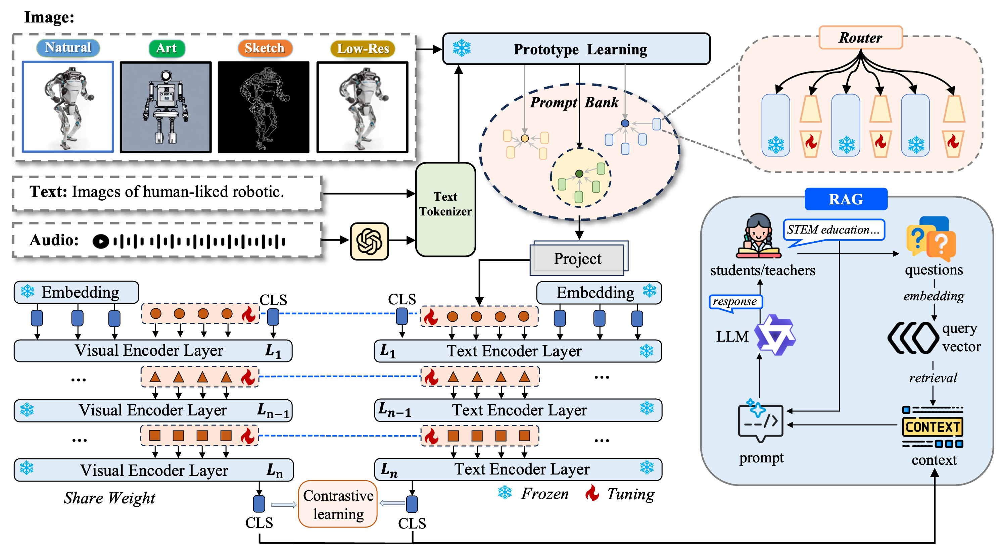

# Ongoing-Collaborative-Projects
Ongoing collaborative projects with prof. Erik Cambria in NTU and prof.  Feng-Kuang Chiang in SJTU.

# Projects 1: Uni-RAG: From Query to Explanation

> **Authors**：Xinyi Wu, Yanhao Jia, Luwei Xiao, Shuai Zhao, Fengkuang Chiang, Erik Cambria  
> **Submitted to**: IEEE TKDE, 2025  

## 1. Introduction 论文简介

AI-facilitated teaching (AI4EDU) leverages advanced AI to enhance instructional design, learning processes, and assessment across diverse educational settings. Traditional retrieval systems—optimized for natural text–image matching—struggle with the explosion of interdisciplinary STEM resources (diagrams, simulations, multimedia), leading to imprecise or biased results when faced with noisy inputs like sketches or audio. There is a growing need for retrieval algorithms that balance modality adaptability, semantic generalization, and computational efficiency in educational scenarios.
人工智能在教育（AI4EDU）中应用日益广泛，通过先进的AI技术能够优化教学设计、学习流程和评估。然而，传统的检索系统主要针对自然语言和高分辨率图像匹配，在面临 STEM 场景中大量跨学科资源（如示意图、交互式仿真、多媒体）时，难以处理手绘草图或音频等噪声输入，容易导致检索不准确或偏差。因此，教育场景下亟需兼顾多模态适应性、语义泛化能力与计算效率的新一代检索算法。

Fig. 1. This advancement provides a scalable and precise solution for diverse educational needs. Previous retrieval models focus on text-query retrieval data or simple image-text retrieval. Our style-diversified retrieval setting accommodates the various query styles preferred by real educational content.
图 1. 这项进步为多样化的教育需求提供了可扩展且精准的解决方案。之前的检索模型侧重于文本查询检索数据或简单的图文检索。我们风格多样化的检索设置能够适应实际教育内容所偏好的各种查询风格。

## 2. Motivation 研究目标

The motivation stems from three key challenges:
	1.	Diverse Query Modalities: Existing systems cannot flexibly handle low-res sketches, audio descriptions, or domain-specific diagrams.
	2.	Semantic Ambiguity: Noisy or imprecise inputs degrade retrieval accuracy, hindering access to pedagogically valuable resources.
	3.	Efficiency Constraints: Educational applications often demand low latency and resource efficiency to be practical in real-time learning environments.
    1.	多样化查询形式： 现有系统难以处理低分辨率草图、音频描述或领域专用示意图。
	2.	语义歧义： 噪声或不精确输入会降低检索准确率，影响获取有教学价值的资源。
	3.	效率要求： 教育场景常需低延迟和资源高效，以满足实时学习需求

## 3. Methods 核心方法

The Uni-RAG model comprises five core submodules :
	1.	**Prototype Learning Module**: Maps diverse inputs (text, various image styles, audio) into a shared embedding space to extract style-aware prototypes.
	2.	**Prompt Bank with MoE-LoRA**: Stores a bank of prompt tokens and adapts them via a Mixture-of-Experts Low-Rank Adapter, enabling dynamic, style-specific prompt generation.
	3.	**Feature Extractor**: Leverages frozen vision-language encoders (e.g., OpenCLIP) and optional audio-to-text conversion (e.g., GPT-4o) to produce multimodal embeddings.
	4.	**Retrieval-Augmented Generation (RAG)**: Combines adapted prompts with top-k retrieved evidence to form structured inputs for the language model, ensuring grounded and context-aware generation.
	5.	**Training & Inference**: Optimizes only the Prompt Bank parameters (≤50M activated), preserving efficiency; during inference, precomputes query embeddings for fast online retrieval.

Uni-RAG 模型由五大子模块组成 ：
	1.	**原型学习模块**： 将文本、多种图像风格、音频等输入映射到共享嵌入空间，提取风格感知原型。
	2.	**MoE-LoRA Prompt Bank**： 存储提示令牌集合，并通过专家混合低秩适配器动态生成特定风格的提示。
	3.	**特征提取器**： 利用冻结的视觉–语言编码器（如 OpenCLIP）及可选的音频转文本模块（如 GPT-4o）生成多模态嵌入。
	4.	**检索-增强生成（RAG）**： 将适应后提示与检索到的前 k 条证据拼接，结构化输入到语言模型，实现有依据的上下文生成。
	5.	**训练与推理**： 仅优化 Prompt Bank 参数（激活不超过 50M），保持轻量；推理时预计算查询嵌入，加速在线检索。

Fig. 2. The Uni-RAG model’s architechture. Shared prompt tokens are extracted from the Prompt Bank and fed into the input of the feature encoder. Each entry in the Prompt Bank is associated with multiple experts, enabling the representation of diverse style features. After retrieving the top-k relevant items, Uni-RAG concatenates the system prompt with the retrieved content and passes it to the LLM to generate the final explanation for the query.
图 2. Uni-RAG 模型架构。共享的提示词从提示库中提取出来，并输入到特征编码器的输入中。提示库中的每个条目都与多位专家相关联，从而能够表示不同的风格特征。检索到前 k 个相关条目后，Uni-RAG 将系统提示与检索到的内容连接起来，并将其传递给 LLM，以生成查询的最终解释。

## 4. Contribution 主要贡献

1. **多风格检索-生成一体化**：首次在 STEM 场景中提出查询原型驱动的 RAG 框架；  
2. **可扩展的 Prompt Bank**：MoE-LoRA 机制让检索器能适应新风格输入；  
3. **实证验证**：在 SER 等数据集上，Uni-RAG 在 R@1/R@5、生成质量和推理速度上均超越 baselines。

## 5.Experiments 实验结果

On the STEM Education Retrieval (SER) benchmark, Uni-RAG significantly outperforms baselines across diverse query styles (text, sketch, art, low-res, audio). Key findings include  :
	•	Retrieval Accuracy: Uni-RAG achieves the highest R@1/R@5 scores (e.g., +12.7% R@1 over fine-tuned CLIP in Text→Image).
	•	Plug-and-Play Flexibility: Prompt Bank structure allows seamless enhancement of other multimodal models.
	•	Efficiency: Only adds ~11 ms per search iteration compared to Uni-Retrieval, while maintaining superior performance .

在 STEM 教育检索基准 SER 上，Uni-RAG 在多种查询风格（文本、草图、艺术图像、低分辨率、音频）中均显著优于各类基线模型  ：
	•	检索准确率： 在 Text→Image 任务中，Uni-RAG 相较于 CLIP-Finetune，R@1 提升 12.7%。
	•	即插即用灵活性： Prompt Bank 结构可无缝增强其他多模态模型的检索能力。
	•	效率： 相较于 Uni-Retrieval，每次检索仅额外增加约 11 ms 时间，性能却更优。

Fig. 3. The case study for our Uni-RAG with the FreestyleRet baseline involves examples from diverse disciplines within Science, Technology, Engineering,
and Mathematics.
图 3. 我们采用 FreestyleRet 基线的 Uni-RAG 案例研究涉及科学、技术、工程和数学等不同学科的示例。
